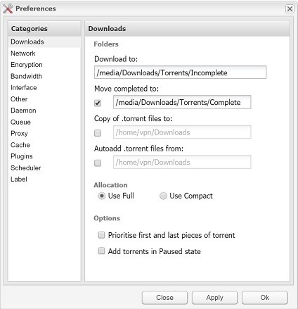
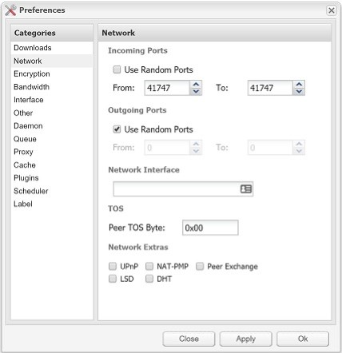
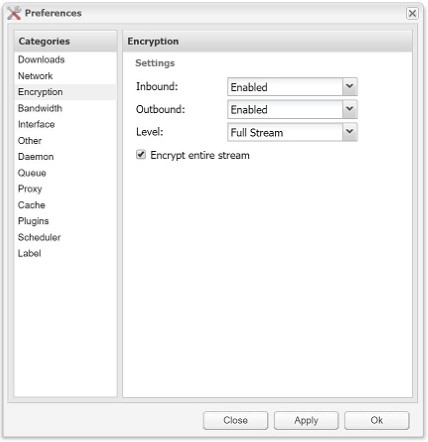
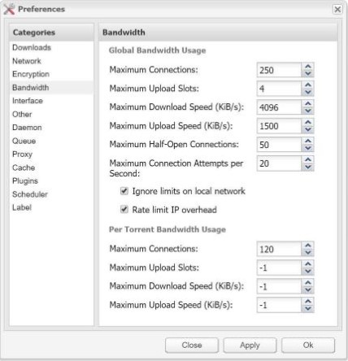
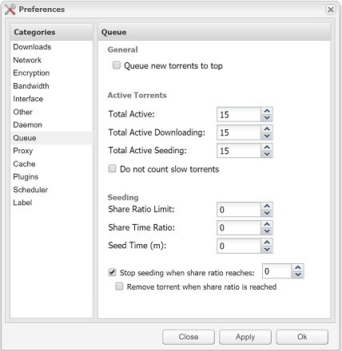
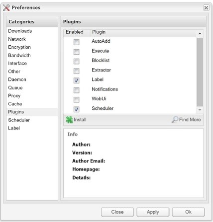

### Downloads
Example of download folders.

### Network
Ensure all `Network Extras` unchecked for maximum security.

### Encryption
Optimal level of encryption.

### Bandwidth
[Make Deluge Automatically Stop Seeding When Download Complete](https://www.htpcguides.com/make-deluge-automatically-stop-seeding-download-complete/) 

### Queue
Adjust as needed.

### Plugins
Needed if using Sonarr or Radarr.

